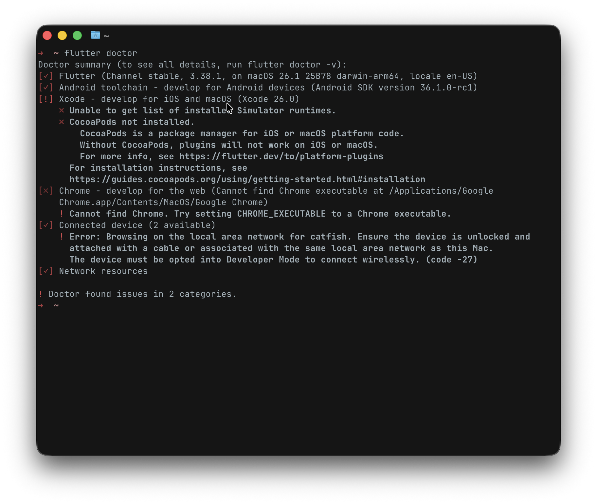
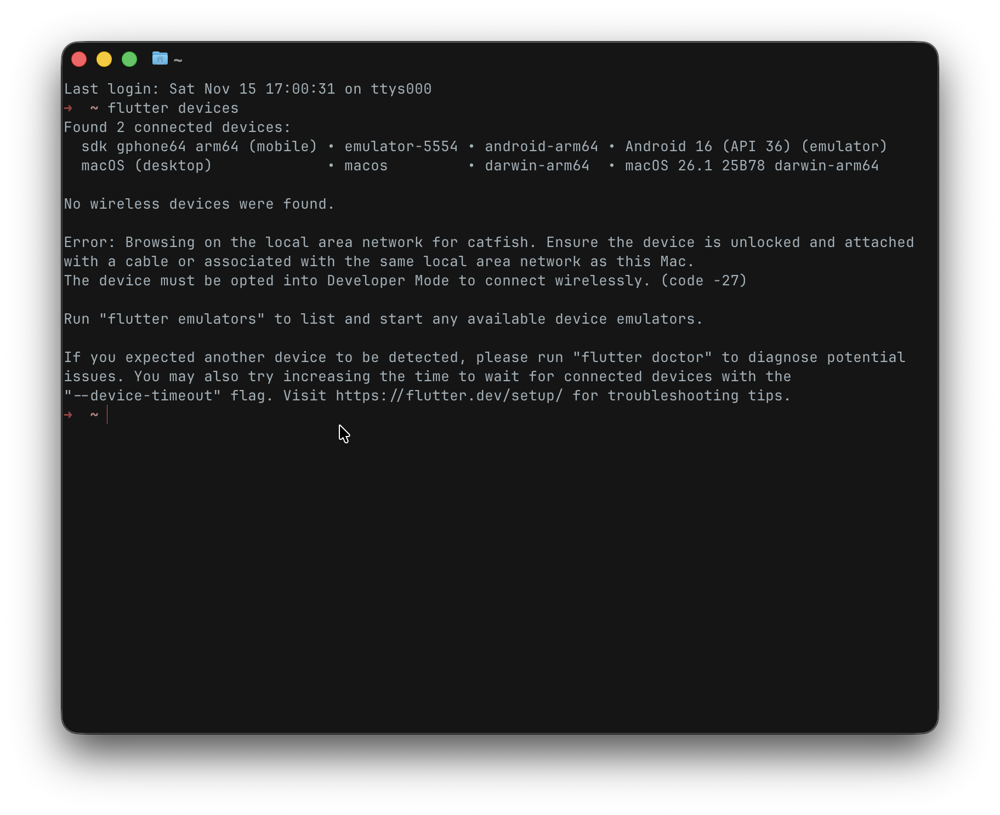
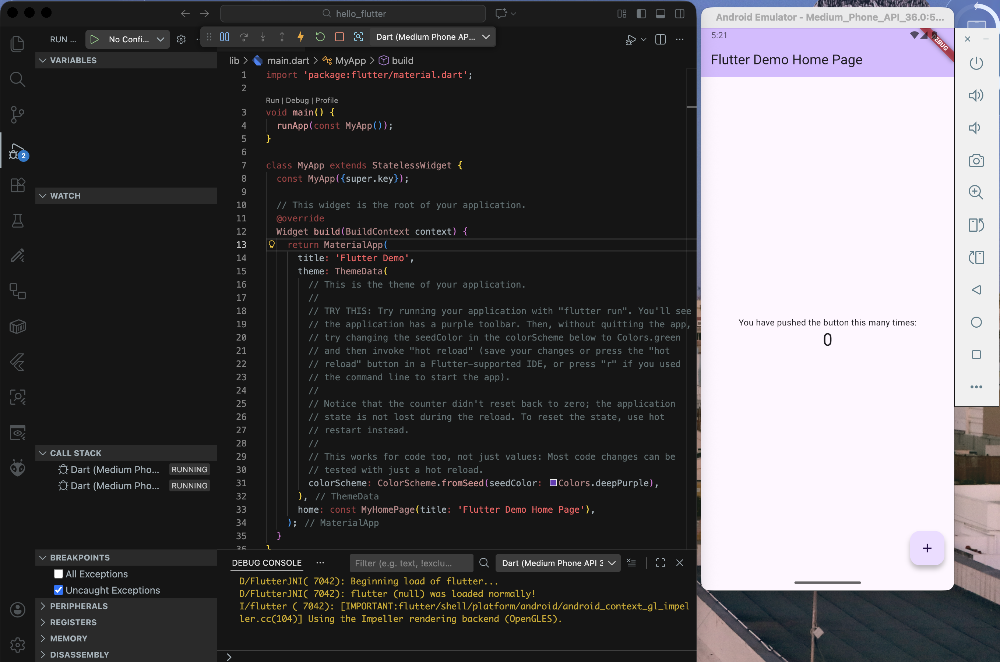

Программирование корпоративных систем. Окишев Александр ЭФБО-10-23.

1.    Сделать скриншот вывода flutter doctor.

В терминал была вписана команда flutter doctor, показывающая установленные ПО. Вывод команды представлен на скриншоте 1.

2.    Сделать скриншот списка устройств после flutter devices.

В терминал была вписана команда flutter devices, которая показывает доступные девайсы. Вывод команды представлен на скриншоте 2.

3.    Сделать скриншот первого приложения hello_flutter.

Запуск начального приложения hello_flutter на эмуляторе смартфона на базе Android. Результат показан на скриншоте 3.

4.    Указать в отчёте:

Операционная система: macOS26 Tahoe. Используемые терминалы: Ghostty, VS Code Terminal.

5.    Краткое описание encountered проблем:

Проблемы отсутствовали.