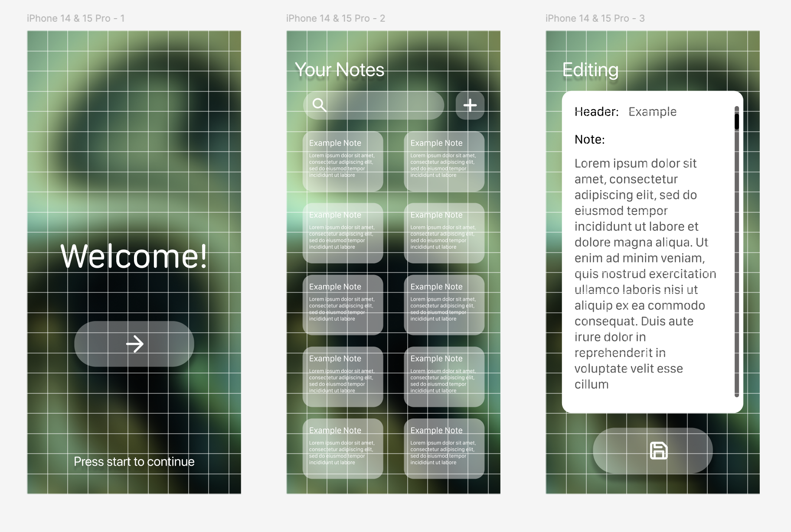
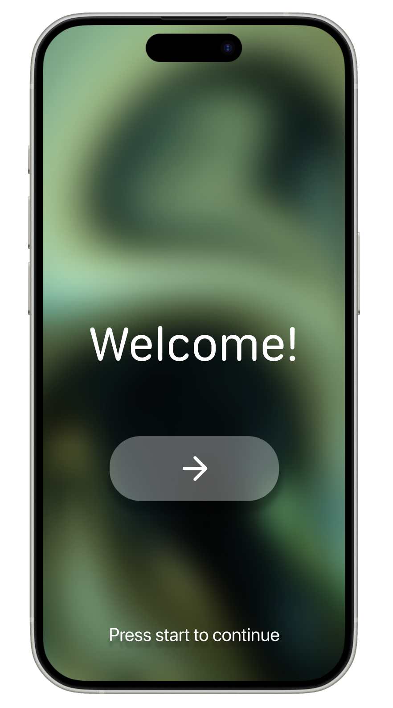
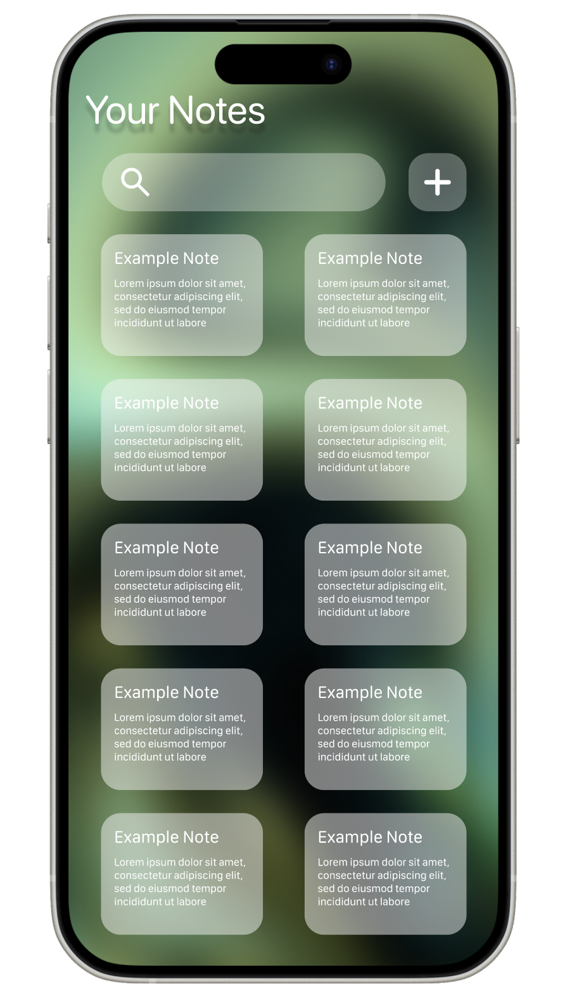
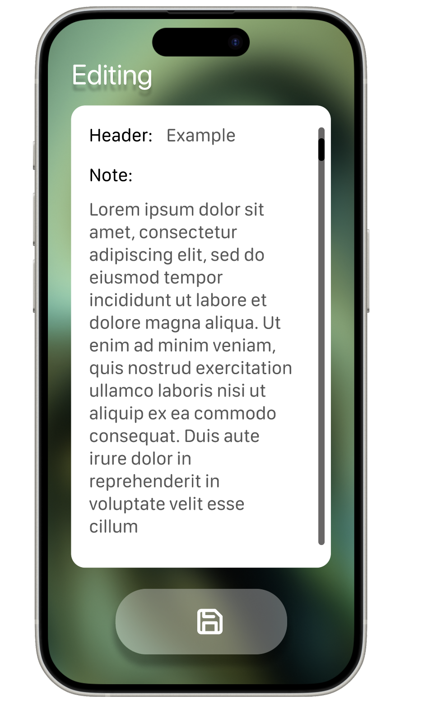
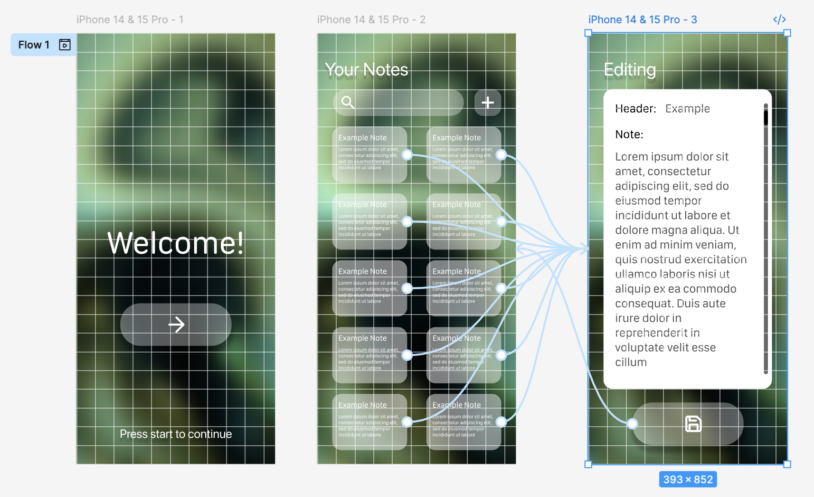

Программирование корпоративных систем. Окишев Александр ЭФБО-10-23.

Работа с макетами пользовательского интерфейса. Создание прототипа мобильного приложения.
Тема интерактивного прототипа: Приложение для заметок

1.    Создание нового проекта и рабочего пространства:

В Figma был создан отдельный файл для дизайна макета. В нём были созданы все экраны под разрешение телефона iPhone 15 Pro.

2.    Создание экрана входа:

Для создания дизайна было решено использовать абстрактный рендер формата PNG и сделать акцент на прозрачности и размытии.

3.    Создание экрана заметок:

В экране находится список созданных заметок, а так же поиск и создание новых заметок.

Экран редактирования заметки.

4.    Связь всех экранов и окон:

После создания всех экранов и окон были созданы переходы между ними.

Вывод: Можно добавить неограниченное количество заметок, а так же редактировать и искать их прямо из главного меню.