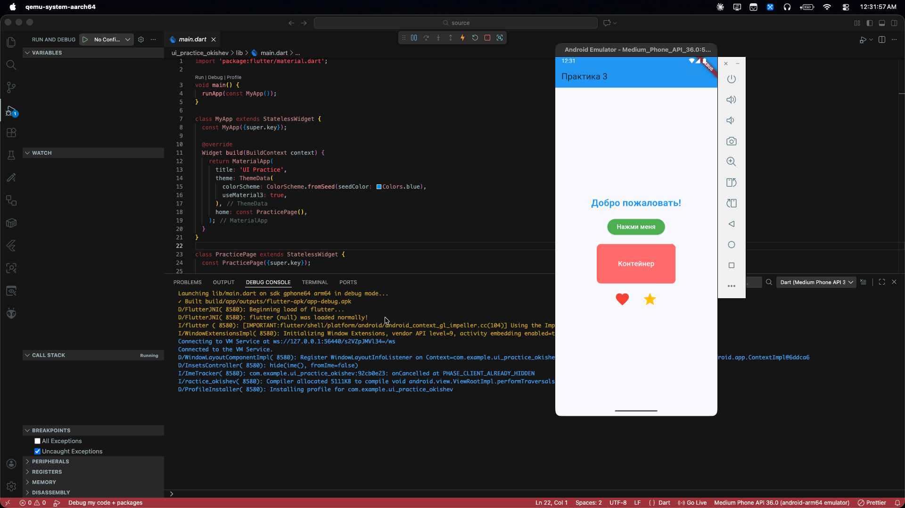
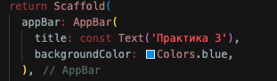
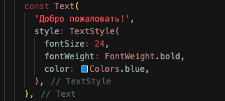
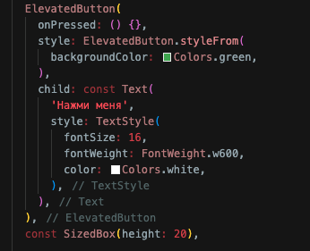
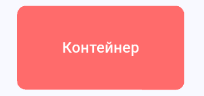
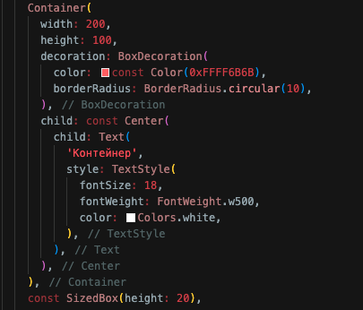
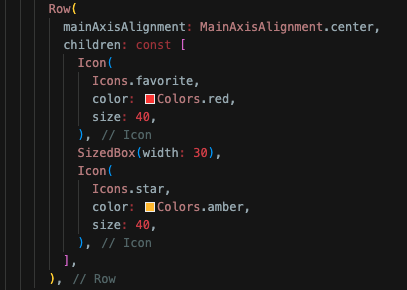

Программирование корпоративных систем. Окишев Александр ЭФБО-10-23.

Работа с компонентами пользовательского интерфейса. Работа с основными виджетами. Работа с цветами, шрифтами и компановкой элементов.

Скриншот с кодом и рабочим приложением:


### AppBar с заголовком "Практика 3" + отрывок кода:



### Collumn:

1.    Текст с приветствием (Text) + отрывок кода:




2.    Кнопка (ElevatedButton) + отрывок кода:




3.    Контейнер (Container) с заданным цветом и размерами + отрывок кода:




4.    Row внутри с двумя Icon + отрывок кода:




Отступы между элементами были реализованы через ``` SizedBox(width: <расстояние в пикселях>)```

В прикреплённом коде и на снимках экрана экрана видна работа как с основными необходимыми виджетами, так и с цветами, параметрами шрифтов,  и компановкой элементов.

Исходный код доступен в папке source.
